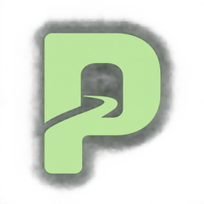
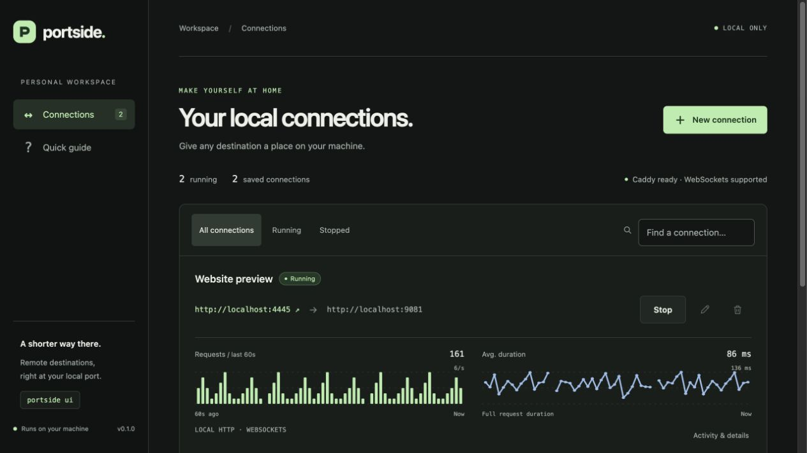
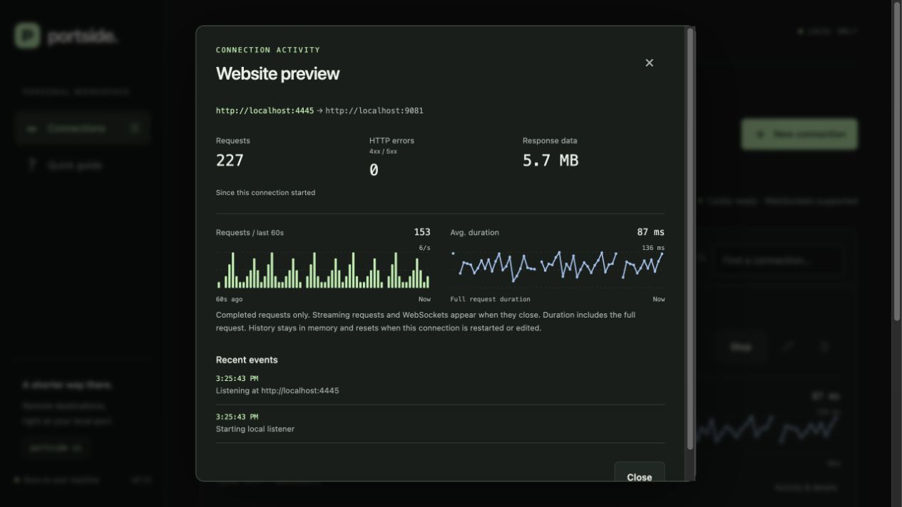

# Portside



Remote destinations. Local ports. A local dashboard and CLI for saved reverse proxies, powered by Caddy.



Manage connections on one page. Each connection shows request volume and average duration over the last minute; setup, totals, and recent events open in dialogs.

## Work by project

Click **New project**, name it, and select its connections. **Start project** and **Stop project** control the group; other projects keep running. If a connection fails, successful ones stay up: the project shows **2/3 running**, the error, and **Retry**.

Expand a project for individual controls and graphs. Editing a project can move running connections without restarting them. Deleting a project keeps its connections under **Ungrouped**.

<details>
<summary>Connection details</summary>



</details>

Screenshots use local demo traffic. Metrics stay in memory and reset when a connection starts. Streaming requests and WebSockets count when they finish.

## Start on macOS

Double-click **[Start Portside.command](Start%20Portside.command)** in Finder. It starts the app in Terminal and opens your default browser. Keep Terminal open; press **Ctrl+C** to stop. Double-clicking again reopens an already-running dashboard.

First time only, install the prerequisites with `brew install uv caddy`. The launcher sets up Python dependencies automatically. Keep it in this project folder; a Finder alias can go on your Desktop.

## Develop locally

Requires Python 3.11+, uv, and Caddy on macOS or Linux.

```sh
brew install caddy uv
uv sync --extra dev
uv run portside ui
```

Open http://127.0.0.1:9876. Create a mapping and press **Start**. Ctrl+C stops the dashboard and its proxies; saved mappings remain.

```sh
uv run portside --port 4444 --to https://example.com
uv run portside --config examples/proxies.toml
uv run portside ui --config examples/proxies.toml
uv run portside doctor
uv run pytest
```

Use `uv tool install --editable .` to install the command outside this checkout.

## Behavior

- IPv4 loopback listeners only; no public hosting or LAN exposure.
- HTTP/HTTPS upstreams, custom ports, paths, queries, uploads, redirects, and WebSockets.
- One Caddy process per mapping. Stopping one leaves others alone.
- Default config: `~/.config/portside/proxies.toml`. Runtime state: `~/.local/state/portside/`.
- After a clean shutdown, saved mappings open stopped. If a previous session crashed and left proxies running, the dashboard verifies their ownership and restarts them automatically to restore controls and graphs. Existing connections briefly reconnect; counters reset. The config CLI starts all mappings together.
- One manager owns a config file at a time. Stop it before editing the file externally.
- Projects are saved as `[[projects]]` entries with stable IDs and `proxy_ids`; old configs without projects still work. Older Portside versions cannot read the new entries: stop Portside and restore your pre-project config backup before downgrading.
- Local HTTPS is optional; certificate trust is installed explicitly by the user.
- Running means the proxy is listening, not that its upstream has passed a health check.

See [the plan](docs/PLAN.md) and [browser compatibility](docs/BROWSER-COMPATIBILITY.md).
